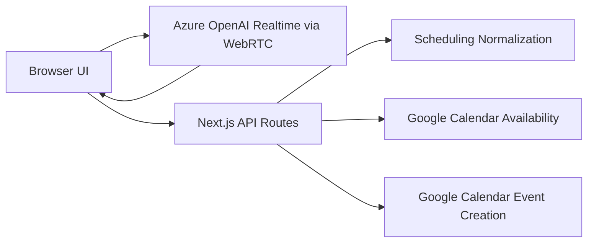

# PingMe

PingMe is a real-time voice scheduling assistant. It starts the conversation, collects scheduling details through live voice interaction, confirms the final slot, and creates a real Google Calendar event.

## Live Demo

- Hosted URL: [https://voice-scheduling-agent-xi.vercel.app/](https://voice-scheduling-agent-xi.vercel.app/)
- Demo video: `ADD_YOUR_LOOM_LINK_HERE`

## What the App Does

PingMe:

- Initiates the conversation first
- Asks for the user's name
- Collects preferred date and time
- Optionally collects a meeting title
- Optionally asks for duration
- Optionally asks whether invitees should be added
- Confirms the final details before booking
- Checks real Google Calendar availability
- Creates a real Google Calendar event
- Supports a deployed, hosted test flow

## How To Test The Hosted App

1. Open the deployed app in Chrome:
   [https://voice-scheduling-agent-xi.vercel.app/](https://voice-scheduling-agent-xi.vercel.app/)
2. Allow microphone access when prompted.
3. Click `Start Talking`.
4. Let PingMe greet first.
5. Respond naturally. A good example is:
   `My name is Harshita. Schedule a demo meeting today at 6 PM.`
6. PingMe will continue the flow by asking for any missing details such as:
   - your name
   - date
   - time
   - optional title
   - optional duration
   - optional invitees
7. When PingMe reads back the final details, confirm them.
8. PingMe will create the event in the connected Google Calendar.
9. After the booking finishes, the UI shows the captured meeting details and success state.

## Notes For Reviewers

- The hosted demo writes to a real Google Calendar connected through server-side credentials.
- This deployment uses a shared evaluation calendar rather than authenticating each visitor into their own calendar.
- Chrome generally gives the smoothest microphone and WebRTC experience.

## Product Flow

1. PingMe greets the user first.
2. The user speaks naturally.
3. PingMe collects structured details from the conversation.
4. The backend normalizes the requested slot.
5. The backend checks Google Calendar availability.
6. If the slot is free, PingMe confirms the final details.
7. If the slot is busy, PingMe offers alternatives.
8. After explicit confirmation, the backend creates the real calendar event.

## Architecture



### End-to-End Request Flow

1. The browser opens a realtime voice session through [`/api/realtime/session`](/Users/harshithakolukuluru/voice-scheduling-agent/app/api/realtime/session/route.ts).
2. Azure OpenAI Realtime handles the live spoken interaction.
3. Once PingMe has enough information, it calls `normalize_meeting_request`.
4. The client forwards that tool call to [`/api/scheduling/normalize`](/Users/harshithakolukuluru/voice-scheduling-agent/app/api/scheduling/normalize/route.ts).
5. The backend normalizes natural-language date and time into a deterministic slot.
6. PingMe then calls `check_calendar_availability`.
7. The client forwards that request to [`/api/calendar/check-availability`](/Users/harshithakolukuluru/voice-scheduling-agent/app/api/calendar/check-availability/route.ts).
8. The backend checks real Google Calendar availability.
9. PingMe reads the normalized details back to the user for confirmation.
10. After explicit confirmation, PingMe calls `create_calendar_event`.
11. The client sends that request to [`/api/calendar/create`](/Users/harshithakolukuluru/voice-scheduling-agent/app/api/calendar/create/route.ts).
12. The backend re-validates the slot and creates the real Google Calendar event.

## Tech Stack

- Next.js 15 App Router
- React 19
- TypeScript
- Azure OpenAI Realtime API over WebRTC
- `gpt-4o-mini-transcribe` for speech transcription
- Google Calendar API via `googleapis`
- `chrono-node` for natural-language date parsing
- Zod for request validation

## Calendar Integration

The app uses server-side Google Calendar access.

- Google credentials never reach the browser.
- The backend authenticates with OAuth client credentials plus a refresh token.
- Availability checks happen before booking.
- The final create step re-validates the slot before writing the event.
- Optional attendee emails can be included in the event.

Relevant implementation:

- Calendar client and operations: [`lib/google-calendar.ts`](/Users/harshithakolukuluru/voice-scheduling-agent/lib/google-calendar.ts)
- Scheduling validation and normalization: [`lib/scheduling.ts`](/Users/harshithakolukuluru/voice-scheduling-agent/lib/scheduling.ts)
- Prompt and tool definitions: [`lib/prompts.ts`](/Users/harshithakolukuluru/voice-scheduling-agent/lib/prompts.ts)

## Local Development

### 1. Install dependencies

```bash
npm install
```

### 2. Create your local env file

```bash
cp .env.example .env.local
```

### 3. Add required environment variables

Use the values below in [`.env.local`](/Users/harshithakolukuluru/voice-scheduling-agent/.env.local):

```env
AZURE_OPENAI_ENDPOINT=https://your-resource.openai.azure.com/
AZURE_OPENAI_API_KEY=your-azure-openai-api-key
AZURE_OPENAI_DEPLOYMENT_NAME=gpt-realtime

GOOGLE_CLIENT_ID=your-google-client-id.apps.googleusercontent.com
GOOGLE_CLIENT_SECRET=your-google-client-secret
GOOGLE_REFRESH_TOKEN=your-google-refresh-token
GOOGLE_CALENDAR_ID=primary

NEXT_PUBLIC_DEFAULT_TIMEZONE=America/New_York
```

### 4. Verify Google Calendar access

If you already have a valid refresh token:

```bash
npm run calendar:verify
```

If you need to generate a new refresh token locally:

```bash
npm run calendar:token
```

Then paste the returned refresh token into `.env.local` and re-run:

```bash
npm run calendar:verify
```

### 5. Start the app

```bash
npm run dev
```

Then open:

[http://localhost:3000](http://localhost:3000)

## Deployment

The app is deployed on Vercel.

### Recommended deployment steps

1. Push the repo to GitHub.
2. Import the repo into Vercel.
3. Add the same environment variables from `.env.local` into Vercel Project Settings.
4. Redeploy after any env var changes.
5. Test the production URL with microphone permissions enabled.

### Required Vercel environment variables

- `AZURE_OPENAI_ENDPOINT`
- `AZURE_OPENAI_API_KEY`
- `AZURE_OPENAI_DEPLOYMENT_NAME`
- `GOOGLE_CLIENT_ID`
- `GOOGLE_CLIENT_SECRET`
- `GOOGLE_REFRESH_TOKEN`
- `GOOGLE_CALENDAR_ID`
- `NEXT_PUBLIC_DEFAULT_TIMEZONE`

Important:

- In Vercel, enter env var values without quotes.
- If you update env vars, redeploy so the new values are picked up.

## Main Files

- App shell: [`app/page.tsx`](/Users/harshithakolukuluru/voice-scheduling-agent/app/page.tsx)
- Voice client and realtime orchestration: [`components/voice-scheduler.tsx`](/Users/harshithakolukuluru/voice-scheduling-agent/components/voice-scheduler.tsx)
- Azure Realtime session bootstrap: [`app/api/realtime/session/route.ts`](/Users/harshithakolukuluru/voice-scheduling-agent/app/api/realtime/session/route.ts)
- Scheduling normalization endpoint: [`app/api/scheduling/normalize/route.ts`](/Users/harshithakolukuluru/voice-scheduling-agent/app/api/scheduling/normalize/route.ts)
- Availability endpoint: [`app/api/calendar/check-availability/route.ts`](/Users/harshithakolukuluru/voice-scheduling-agent/app/api/calendar/check-availability/route.ts)
- Calendar creation endpoint: [`app/api/calendar/create/route.ts`](/Users/harshithakolukuluru/voice-scheduling-agent/app/api/calendar/create/route.ts)
- Reschedule endpoint: [`app/api/calendar/reschedule/route.ts`](/Users/harshithakolukuluru/voice-scheduling-agent/app/api/calendar/reschedule/route.ts)
- Cancel endpoint: [`app/api/calendar/cancel/route.ts`](/Users/harshithakolukuluru/voice-scheduling-agent/app/api/calendar/cancel/route.ts)

## Current Behavior And Scope

- Duration defaults to 30 minutes if the user does not specify one.
- Invitees are optional.
- The assistant confirms final details before booking.
- The app creates real calendar events on the connected Google Calendar.
- Reschedule and cancel support are available for the latest event created in the same live session.

## Known Limitations

- The hosted app uses one connected demo calendar, not per-user Google sign-in.
- Reschedule and cancel are scoped to the current live session’s latest event.
- Voice UX depends on browser mic permissions and network quality.

## Submission Checklist

- GitHub repository: this repo
- Hosted URL: [https://voice-scheduling-agent-xi.vercel.app/](https://voice-scheduling-agent-xi.vercel.app/)
- Calendar integration: documented above
- Demo video / Loom: `ADD_YOUR_LOOM_LINK_HERE`
